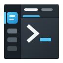
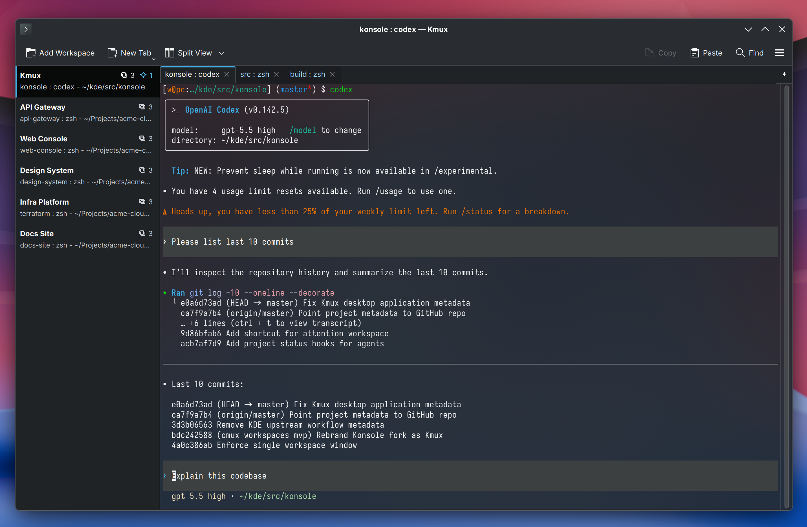

# Kmux

Kmux is a [KDE Konsole](https://apps.kde.org/konsole/) fork with a
[cmux](https://cmux.com/)-inspired workspace model for project-oriented
terminal work.

Each project appears in a vertical sidebar and owns an independent set of
regular terminal tabs and split views. Switching projects changes the visible
context instantly while running terminal sessions stay alive.



## Features

- vertical project workspaces with renaming and drag-and-drop ordering;
- independent horizontal terminal tabs, active tab, and split/view state in
  every project;
- project summaries, activity indicators, terminal notifications, and agent
  statuses such as running, idle, and needs input;
- workspace restoration for project titles and order, tabs, split layouts,
  profiles, working directories, and active selections;
- Konsole profiles, color schemes, shortcuts, search, plugins, session
  handling, and KDE/Qt integration;
- side-by-side installation with KDE Konsole.

Workspace restoration recreates the terminal layout and session metadata. It
does not checkpoint arbitrary running processes.

## Why Kmux

Regular terminal tabs become hard to manage when work is organized by projects.
Kmux adds a project layer above normal terminal tabs so each project keeps its
own terminal context instead of sharing one global tab strip.

Kmux is not a terminal multiplexer server like tmux. It is a graphical terminal
emulator for desktop workflows where projects, tabs, and split views should stay
visually separate.

## First Steps

1. Start Kmux and use the project rail on the left to add a project.
2. Double-click a project name to rename it, or use the project context menu.
3. Create regular terminal tabs and split views with the familiar Konsole
   actions and shortcuts.
4. Switch projects from the rail. Each project preserves its own selected tab
   and split layout.
5. Drag projects in the rail to reorder them.

## Agent Status Integration

Kmux can show when Codex or Claude Code is running, idle, or waiting for input.
After installing Kmux, enable the integration with:

```sh
kmux-agent-hooks install codex
kmux-agent-hooks install claude
```

The commands update the respective agent configuration under `~/.codex` or
`~/.claude`. Use `status` or `uninstall` in place of `install` to inspect or
remove the integration. The `kmux-codex` and `kmux-claude` helpers install the
matching hooks, associate status with the agent process, and then launch it. Set
`KMUX_CODEX_HOOKS_DISABLED=1` or `KMUX_CLAUDE_HOOKS_DISABLED=1` to launch the
agent without installing or updating its hooks. The legacy
`KONSOLE_CODEX_HOOKS_DISABLED=1` name remains supported for compatibility.

Agent hooks communicate with the Kmux session through the
`KMUX_DBUS_*` environment exported inside Kmux terminals. These helpers are
built when DBus support is enabled.

## Foundation and Inspiration

Kmux is built on [KDE Konsole](https://apps.kde.org/konsole/) and retains its
terminal emulation, profiles, tabs, split views, plugins, shortcuts, and KDE
integration. Upstream development takes place in the
[KDE Konsole source repository](https://invent.kde.org/utilities/konsole).

The project workspace model is inspired by
[cmux](https://github.com/manaflow-ai/cmux), particularly its combination of
vertical workspaces, horizontal tabs, and attention indicators. Kmux is a
separate KDE/Qt implementation; cmux is a UX inspiration rather than its
codebase.

Kmux is an independent project and is not officially affiliated with KDE or
cmux. KDE, Konsole, and cmux names remain the property of their respective
owners.

## Build From Source

The minimum build requirements are:

- CMake 3.16;
- Qt 6.5;
- KDE Frameworks 6.0 and Extra CMake Modules 6.0;
- ICU 61;
- libssh 0.9.8 on supported Unix platforms when `WITH_LIBSSH` is enabled.

Configure and build Kmux with:

```sh
cmake -S . -B build -DCMAKE_BUILD_TYPE=Release
cmake --build build
```

To run from the build tree:

```sh
./build/bin/kmux
```

On Linux and BSD, DBus and libssh integrations are enabled by default. libssh
can be disabled when configuring with `-DWITH_LIBSSH=OFF`.

Run the test suite with:

```sh
ctest --test-dir build --output-on-failure
```

## Konsole Compatibility and Packaging

Kmux is designed to install next to KDE Konsole without depending on the
distribution's `konsole` package. Packagers should depend directly on the
required Qt and KDE Frameworks libraries.

The public install surface is renamed to avoid conflicts:

- binary: `kmux`;
- desktop/AppStream ID: `io.github.vityas_off.kmux`;
- config file: `kmuxrc`;
- data directory: `~/.local/share/kmux`;
- DBus environment variables: `KMUX_DBUS_*`;
- helper tools: `kmux-project-status`, `kmux-codex`, `kmux-claude`, and `kmux-agent-hooks`;
- plugin namespace: `kmuxplugins`.

The source still contains many internal `Konsole` class, namespace, and file
names. That is deliberate: it keeps the fork easier to rebase while the
installed application behaves as a standalone product.

## Source Layout

| Directory | Description |
| --- | --- |
| `src` | Application, terminal emulator integration, sessions, profiles, project workspaces, and plugins. |
| `desktop` | Desktop entry, AppStream metadata, notification config, and XMLGUI resources. |
| `data` | Bundled profiles, keyboard layouts, color schemes, and layouts. |
| `doc` | Upstream documentation sources retained for reference; Konsole handbook installation is disabled for side-by-side packaging. |
| `tests` / `src/autotests` | Upstream and fork tests. Some upstream tests still refer to Konsole names and need follow-up updates. |

## Project Status

Kmux is pre-release software currently versioned as 0.1.0. The fork is being
prepared for its first public release, so interfaces, metadata, and packaging
may still change.

Bug reports and contributions are welcome through
[GitHub Issues](https://github.com/vityas-off/kmux/issues) and
[pull requests](https://github.com/vityas-off/kmux/pulls).

## License and Attribution

Kmux preserves Konsole's upstream licensing and attribution. See
[`COPYING`](COPYING), [`COPYING.LIB`](COPYING.LIB), and
[`COPYING.DOC`](COPYING.DOC) for the licenses covering the application,
libraries, and documentation.
