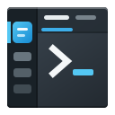
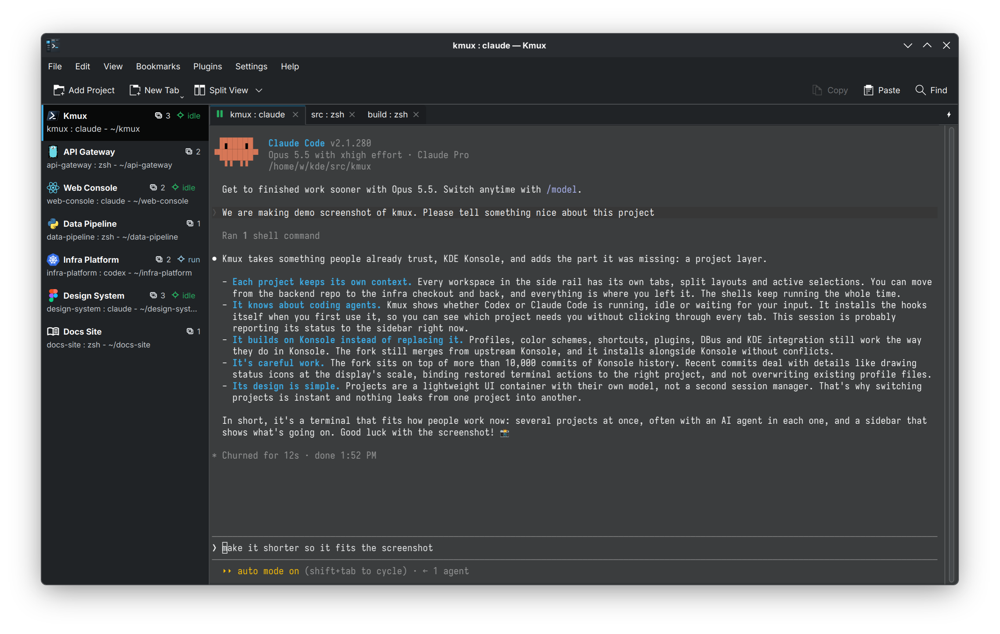

# Kmux

Kmux is a [KDE Konsole](https://apps.kde.org/konsole/) fork with a
[cmux](https://cmux.com/)-inspired workspace model for project-oriented
terminal work.

Each project appears in a vertical sidebar and owns an independent set of
regular terminal tabs and split views. Switching projects changes the visible
context instantly while running terminal sessions stay alive.



## Features

- vertical project workspaces with renaming and drag-and-drop ordering;
- independent horizontal terminal tabs, active tab, and split/view state in
  every project;
- project summaries, activity indicators, terminal notifications, and agent
  statuses such as running, idle, and needs input;
- workspace restoration for project titles and order, tabs, split layouts,
  profiles, working directories, and active selections;
- Konsole profiles, color schemes, shortcuts, search, plugins, session
  handling, and KDE/Qt integration;
- side-by-side installation with KDE Konsole.

Kmux is alpha software; read the [known limitations](#alpha-status-and-known-limitations)
before relying on it.

## Why Kmux

Regular terminal tabs become hard to manage when work is organized by projects.
Kmux adds a project layer above normal terminal tabs so each project keeps its
own terminal context instead of sharing one global tab strip.

Kmux is not a terminal multiplexer server like tmux. It is a graphical terminal
emulator for desktop workflows where projects, tabs, and split views should stay
visually separate.

## First Steps

1. Start Kmux and use the project rail on the left to add a project.
2. Double-click a project name to rename it, or use the project context menu.
3. Create regular terminal tabs and split views with the familiar Konsole
   actions and shortcuts.
4. Switch projects from the rail. Each project preserves its own selected tab
   and split layout.
5. Drag projects in the rail to reorder them.

## Workspace Restoration

When Kmux starts, it restores the projects from its last run: their order,
titles, and icons, the active project, and the width of the project rail.
Every project gets back its tabs, split layouts, and active tab, and every
terminal its working directory, profile, tab title and colors, encoding, and
badge.

Restoration recreates terminals; it does not checkpoint running processes.
Every restored terminal starts a new process:

- A terminal that ran your shell starts a new shell in the saved directory.
  Programs you started from that shell, such as editors, `ssh`, builds, Claude
  Code, or Codex, are not started again, and scrollback is not restored. Resume
  an agent conversation yourself, for example with `claude --continue` or
  `codex resume`.
- A terminal that was opened with a command, for example `kmux -e htop` or a
  profile with a custom command, runs that command again, but only if it was
  still running when Kmux closed.
- A finished command is not saved, even if `--hold` kept its tab open, so it
  never runs again by accident.

Projects that were in the background start their terminals when you first open
them after a restart.

Kmux saves the workspace when its window closes normally and when the desktop
session ends. If Kmux crashes or is killed, the next start restores the
workspace from the last normal close.

### Resetting Workspace State

The workspace state is stored in `~/.local/state/kmuxstaterc`
(`$XDG_STATE_HOME/kmuxstaterc` if `XDG_STATE_HOME` is set). Kmux skips saved
tabs it cannot use and opens a new shell in a project that has none left. If
the restored workspace is still broken, reset it:

1. Quit Kmux. It writes the file again when its window closes.
2. Move the file aside rather than deleting it, so it can be attached to a bug
   report:

   ```sh
   mv ~/.local/state/kmuxstaterc ~/.local/state/kmuxstaterc.old
   ```

3. Start Kmux. It opens with a single new project.

This also resets the saved window size. Settings (`~/.config/kmuxrc`),
profiles, color schemes, and custom project icons (`~/.local/share/kmux`) are
kept.

## Agent Status Integration

Kmux can show when Codex or Claude Code is running, idle, or waiting for input.
Inside Kmux terminals, the regular `codex` and `claude` commands are
transparently routed through Kmux helpers. The helpers install or repair the
matching hooks on first launch, associate status with the agent process, and
then launch the original command from the rest of `PATH`.

Hooks can also be installed or inspected explicitly:

```sh
kmux-agent-hooks install codex
kmux-agent-hooks install claude
```

The commands update the respective agent configuration under `~/.codex` or
`~/.claude`. Use `status` or `uninstall` in place of `install` to inspect or
remove the integration. Set `KMUX_CODEX_HOOKS_DISABLED=1` or
`KMUX_CLAUDE_HOOKS_DISABLED=1` to launch the agent without installing or
updating its hooks. The legacy
`KONSOLE_CODEX_HOOKS_DISABLED=1` name remains supported for compatibility.

Agent hooks communicate with the Kmux session through the
`KMUX_DBUS_*` environment exported inside Kmux terminals. These helpers are
built when DBus support is enabled.

By default, Kmux also prevents automatic system sleep while at least one
integrated agent reports that it is running. Sleep is allowed again when all
agents become idle or wait for input. This behavior can be disabled in the
General settings and requires DBus support.

### Shift+Enter

Kmux intentionally changes Konsole's default `Shift+Enter` binding to send a
newline (`\n`). This enables multiline input in terminal coding agents such as
Claude Code. See [Configuring Shift+Enter for Claude Code in
Konsole](https://www.reddit.com/r/ClaudeAI/comments/1nuvtwv/configuring_shiftenter_for_claude_code_in_konsole/)
for background and manual configuration details. Users who need Konsole's
upstream behavior can select or customize another key binding in the active
profile's Keyboard settings.

## Foundation and Inspiration

Kmux is built on [KDE Konsole](https://apps.kde.org/konsole/) and retains its
terminal emulation, profiles, tabs, split views, plugins, shortcuts, and KDE
integration. Upstream development takes place in the
[KDE Konsole source repository](https://invent.kde.org/utilities/konsole).

The project workspace model is inspired by
[cmux](https://github.com/manaflow-ai/cmux), particularly its combination of
vertical workspaces, horizontal tabs, and attention indicators. Kmux is a
separate KDE/Qt implementation; cmux is a UX inspiration rather than its
codebase.

Kmux is an independent project and is not officially affiliated with KDE or
cmux. KDE, Konsole, and cmux names remain the property of their respective
owners.

## Build From Source

Kmux needs CMake 3.16, a C++20 compiler, Qt 6.5, KDE Frameworks 6.6, ICU,
and, by default, libssh. Configure and build it with:

```sh
cmake -B build -G Ninja -DCMAKE_BUILD_TYPE=Release -DCMAKE_INSTALL_PREFIX=/usr
cmake --build build
```

[`BUILD.md`](BUILD.md) lists the complete dependencies, the Arch Linux
packages, build options, testing, and installation.

## Konsole Compatibility and Packaging

Kmux is designed to install next to KDE Konsole without depending on the
distribution's `konsole` package. Packagers should depend directly on the
required Qt and KDE Frameworks libraries.

The public install surface is renamed to avoid conflicts:

- binary: `kmux`;
- desktop/AppStream ID: `io.github.vityas_off.kmux`;
- config file: `kmuxrc`;
- data directory: `~/.local/share/kmux`;
- DBus environment variables: `KMUX_DBUS_*`;
- helper tools: `kmux-project-status`, `kmux-codex`, `kmux-claude`, and `kmux-agent-hooks`;
- plugin namespace: `kmuxplugins`.

The source still contains many internal `Konsole` class, namespace, and file
names. That is deliberate: it keeps the fork easier to rebase while the
installed application behaves as a standalone product.

## Source Layout

| Directory | Description |
| --- | --- |
| `src` | Application, terminal emulator integration, sessions, profiles, project workspaces, and plugins. |
| `desktop` | Desktop entry, AppStream metadata, notification config, and XMLGUI resources. |
| `data` | Bundled profiles, keyboard layouts, color schemes, and layouts. |
| `doc` | Upstream documentation sources retained for reference; Konsole handbook installation is disabled for side-by-side packaging. |
| `tests` / `src/autotests` | Upstream and fork tests. Some upstream tests still refer to Konsole names and need follow-up updates. |

## Alpha Status and Known Limitations

Kmux is alpha software, currently versioned as 0.1.0-alpha.1. It may still
contain bugs that lose the saved workspace or show a status, notification, or
new tab in the wrong project. Interfaces, metadata, and packaging may change.

Known limitations:

- Kmux uses a single main window. Starting `kmux` while it is running opens a
  new tab in the active project. There is no New Window action, and tabs and
  split views cannot be detached into separate windows.
- Restoration recreates terminals but does not checkpoint running processes;
  see [Workspace Restoration](#workspace-restoration).
- The workspace is saved only when the window closes normally or the desktop
  session ends.
- The format of the saved workspace may change between alpha releases without
  migration. If an upgrade restores projects incorrectly,
  [reset the workspace state](#resetting-workspace-state).
- Agent status integration and sleep inhibition require a build with DBus
  support.
- The embeddable terminal part, `kmuxpart`, provides plain terminals without
  the project rail. Applications such as Dolphin and Kate continue to embed
  Konsole's own part.
- The project rail, project icons, and agent statuses are available in English
  only. The rest of the interface uses the translations inherited from Konsole.
- Kmux is tested mainly on Arch Linux and KDE Linux with Plasma on Wayland. The
  X11 integration is built but has had less testing.

## Reporting Problems

Report bugs and ask questions in
[GitHub Issues](https://github.com/vityas-off/kmux/issues); contributions are
welcome as [pull requests](https://github.com/vityas-off/kmux/pulls). Kmux is
not supported by KDE, so please do not report Kmux problems to the KDE bug
tracker unless they also occur in Konsole.

Please include:

- the output of `kmux --version`;
- your distribution and the Plasma, KDE Frameworks, and Qt versions, and
  whether the session uses Wayland or X11 (`kinfo` prints all of them);
- how Kmux was installed;
- the steps that lead to the problem.

For a restore problem, a copy of `~/.local/state/kmuxstaterc` helps. Review it
before attaching it: it contains your project titles, working directories, and
the commands, arguments, and profile environment variables of your terminals.

To collect debug output, quit Kmux and start it from another terminal with
`QT_LOGGING_RULES='io.github.vityas_off.kmux*.debug=true' kmux`.

Please report security issues privately as described in
[`SECURITY.md`](SECURITY.md).

## License and Attribution

Kmux preserves Konsole's upstream licensing and attribution. See
[`COPYING`](COPYING), [`COPYING.LIB`](COPYING.LIB), and
[`COPYING.DOC`](COPYING.DOC) for the licenses covering the application,
libraries, and documentation.
